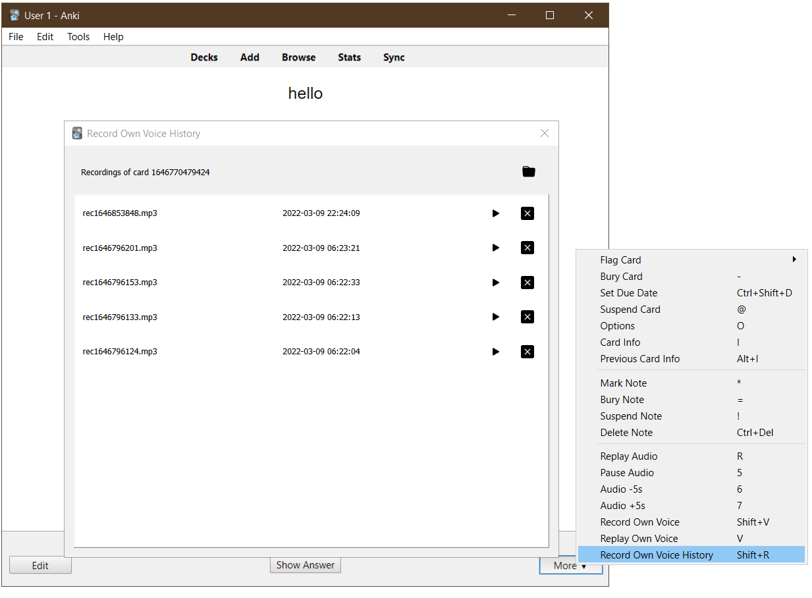

[Anki](https://apps.ankiweb.net/) add-on that enhances the ["Record Own Voice"](https://docs.ankiweb.net/studying.html#editing-and-more) option
in the reviewer by keeping all recorded audio files and providing a GUI to see previous recordings.

I wanted to record my pronunciation each time I see a word/sentence card and timestamp the recordings to track my progress.
I initially wrote a [simpler add-on](https://github.com/abdnh/anki-misc/blob/master/timestamp_recording/__init__.py)
that just prepends a timestamp before sound tags Anki generates after recording
in the editor window. But then I noticed this takes me a lot of time, as I have
to open the editor window each time, select the appropriate field, and click F5 to record.
I then remembered Anki's "Record Own Voice" option and thought of tweaking it to make my life easier.

I also tweaked the "Replay Own Voice" option to make it look for any previous
recordings associated with the current card.

The add-on doesn't modify the note contents in any way;
it saves the recordings in its folder and not in Anki's media folder.
Thus, recordings are not synced to AnkiWeb.

## Credit

Icons are taken from [Bootstrap Icons](https://icons.getbootstrap.com/) and licensed under the MIT license.
